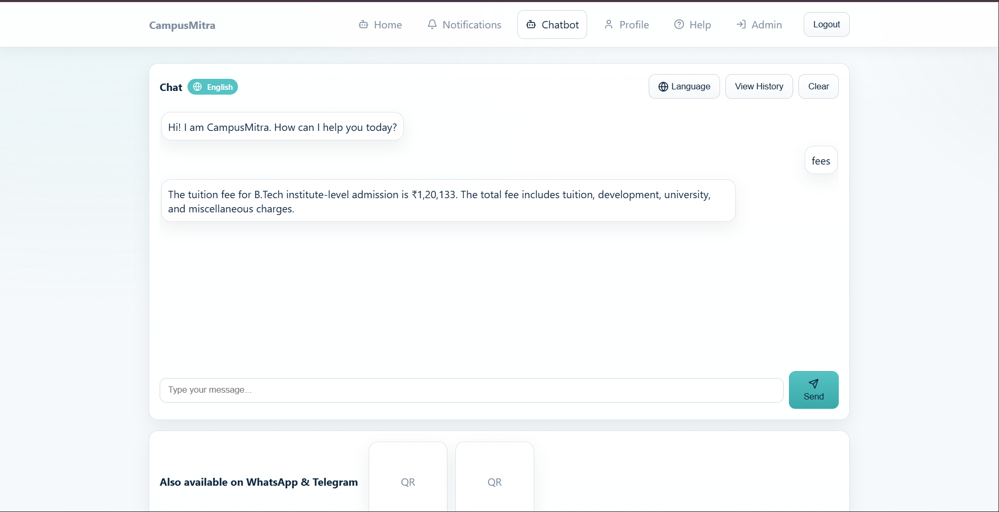
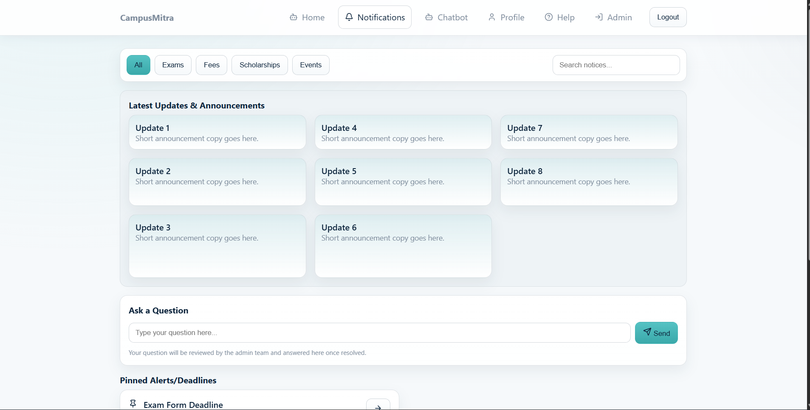
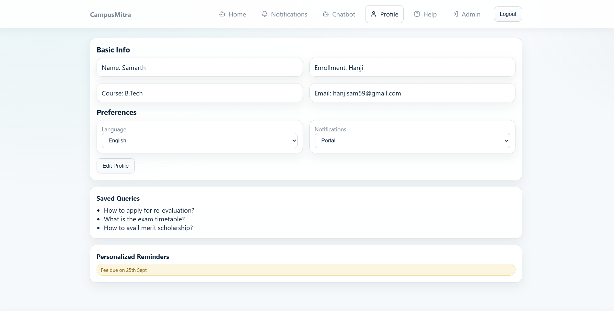

# 🎓 CampusBot – AI-Powered College Assistant

CampusBot is a full-stack MERN web application that helps students access college-related information through an intelligent chatbot. It also provides an admin dashboard for managing notices, PDFs, FAQs, and student queries.

---

## 🚀 Features

### 👨‍🎓 Student Module
- Student Registration & Login
- AI Chatbot for college-related queries
- View latest notices
- Profile management
- Multilingual support

### 👨‍💼 Admin Module
- Secure Admin Login
- Upload PDF documents
- Manage Notices
- View Student Queries
- Dashboard for administration

### 🤖 AI Features
- Intelligent Question Answering
- Multilingual Translation
- Context-aware Responses

---

## 🛠 Tech Stack

### Frontend
- React.js
- Vite
- CSS
- Zustand (State Management)

### Backend
- Node.js
- Express.js

### Database
- MongoDB

### Authentication
- JWT (JSON Web Token)

### Other Technologies
- PDF Parsing
- AI Translation Utilities
- REST APIs
- 
---

## 📂 Project Structure

```
CampusBot
│
├── backend
│   ├── config
│   ├── models
│   ├── routes
│   ├── middlewears
│   ├── utils
│   ├── package.json
│   └── server.js
│
├── frontend
│   ├── public
│   ├── src
│   │   ├── components
│   │   ├── pages
│   │   ├── store
│   │   └── data
│   ├── package.json
│   └── vite.config.js
│
└── README.md
```

---

## ⚙️ Installation

### Clone Repository

```bash
git clone https://github.com/hanjisam59/CampusBot.git
```

### Backend Setup

```bash
cd backend
npm install
npm start
```

### Frontend Setup

```bash
cd frontend
npm install
npm run dev
```

---

## 🔒 Environment Variables

Create a `.env` file inside the **backend** folder.

Example:

```env
PORT=5000

MONGO_URI=your_mongodb_connection_string

JWT_SECRET=your_secret_key
```


---

## 📸 Project Screenshots

### 🏠 Home Page


---

### 🔐 Student Login


---

### 🤖 AI Chatbot



---

### 📢 Notifications



---

### 👤 Student Profile



---

### 👨‍💼 Admin Dashboard


---


## 🌐 Future Improvements

- Voice Assistant
- Dark Mode
- Email Notifications
- AI Summarization
- Mobile Application
- Cloud Deployment

---

## 👨‍💻 Author

**Samarth Hanji**

GitHub:
https://github.com/hanjisam59


---

## ⭐ Support

If you found this project useful, consider giving it a ⭐ on GitHub.
